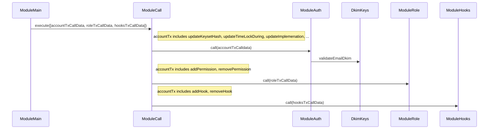
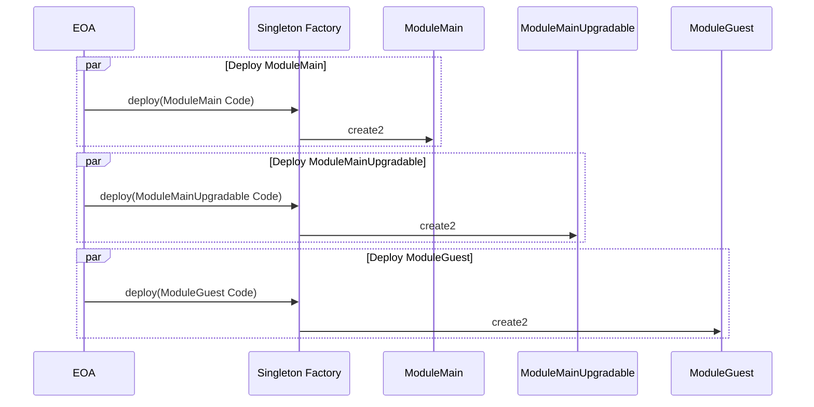
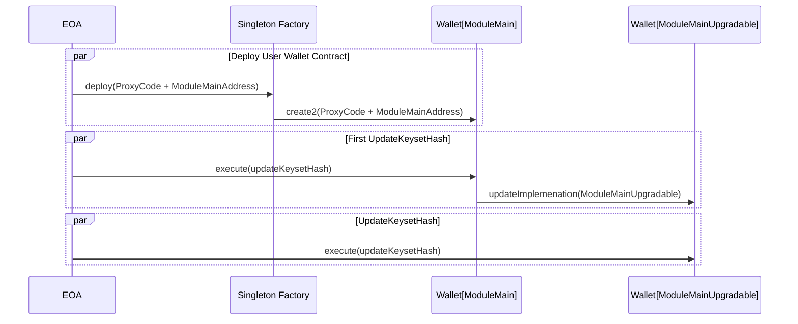
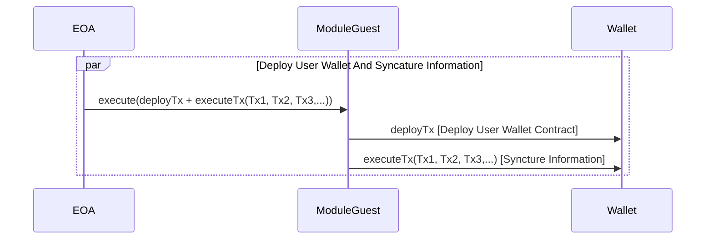
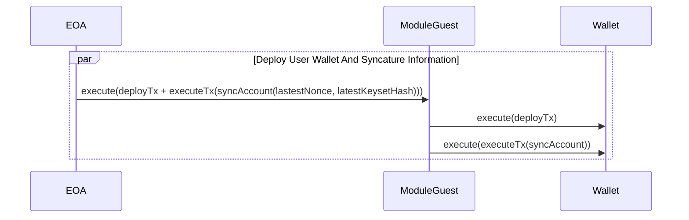

# Unipass Wallet Contracts

Contracts of unipass wallet based on unipass accounts system.

## Architecture

Internal Architecture in Contracts:

- ModuleMain is the entrypoint of Unipass-Wallet.
- Method `execute` in the ModuleCall is the entrypoint of Unipass-Wallet transactions.
- ModuleAuth validates transaction signature and supports account layer transactions.
- ModuleRole supports authorization weights and executive roles of Unipass-Wallet permissions, whose value is method selectors.
- ModuleHooks supports hooks relative methods. You can delegateCall methods by the hooks.



Deployment:



Architecture:



Synchronize Infomation to another blockchain By Playback Transaction:



Synchronize Infomation to another blockchain By SyncAccount:



## ModuleMain

The Entrypoint of Unipass Wallet.

### Constructor

```solidity
constructor(
  address _factory,
  address _moduleMainUpgradable,
  IDkimKeys _dkimKeys
) ModuleAuthFixed(_factory, _moduleMainUpgradable, _dkimKeys) {}

```

Parameters:
| Name | Type | Dsccription |
|:-:|:-:|:-:|
| \_factory | address | The Address Of ERC2470 Singleton Factory, usually `0xce0042b868300000d44a59004da54a005ffdcf9f` |
| \_moduleMainUpgradable | address | The Address Of ModuleMainUpgradable, which is used for first contract upgrade |
| \_dkimKeys | address | The Address Of DkimKeys, which is used for Dkim Verify |

## ModuleMainUpgradable

The Entrypoint of Unipass Wallet.

### Constructor

```solidity
constructor(IDkimKeys _dkimKeys) ModuleAuthUpgradable(_dkimKeys) {}

```

Parameters:
| Name | Type | Description |
|:-:|:-:|:-:|
| \_dkimKeys | address| The Address Of DkimKeys, which is used for Dkim Verify |

## ModuleCall

### Execute

The Entrypoint to Execute Transaction.

```solidity
function execute(
  Transaction[] calldata _txs,
  uint256 _nonce,
  address feeToken,
  address feeReceiver,
  uint256 feeAmount,
  bytes calldata _signature
) external payable;

```

Parameters:
| Name | Type | Description |
|:-:|:-:|:-:|
| \_txs | Transaction[] | Transactions to execute |
| \_nonce | uint256 | Signature Nonce |
| feeToken | address | ERC20 Token Address to pay fee |
| feeReceiver | address | Fee Receiver Address |
| \_signature | bytes | Signature bytes |

### IsValidCallData

To validate calldata of Transaction.

```solidity
function isValidCallData(
  bytes calldata _callData,
  bytes32 _digestHash,
  bytes calldata _signature
) external view returns (bool success);

```

Parameters:
| Name | Type | Description |
|:-:|:-:|:-:|
| \_callData | bytes | Calldata of One Transaction |
| \_digestHash | bytes32 | The Hash to validate signature |
| \_signature | bytes | The internal signature of One Transaction |

Returns:
| Name | Type | Description |
|:-:|:-:|:-:|
| success | bool | Whether Calldata is valid |

## ModuleRole

The Signature Role And Signature Weight Principle.

### AddPermission

Add Permission And Threshold for A Role.

```solidity
function addPermission(
  Role _role,
  bytes4 _permission,
  uint32 _threshold
) external onlySelf;

```

Parameters:
| Name | Type | Description |
|:-:|:-:|:-:|
| \_role | Role | The Signature Role |
| \_permission | bytes4 | The Permission Of The Role, whose value is the selector of Method |
| \_threshold | uint32 | The Threshold required by the Permission |

### RemovePermission

Remove Permission.

```solidity
function removePermission(bytes4 _permission) external onlySelf;

```

Parameters:
| Name | Type | Description |
|:-:|:-:|:-:|
| \_permission | bytes4 | The Permission |

### GetRoleOfPermission

Get Role and Threshold of Permission.

```solidity
function getRoleOfPermission(bytes4 _permission) public view returns (Role role, uint32 threshold);

```

Parameters:
| Name | Type | Description |
|:-:|:-:|:-:|
| \_permission | bytes4 | The Permission |

Returns
| Name | Type | Description |
|:-:|:-:|:-:|
| role | Role | The Role Of The Permission |
| threshold | uint32 | The Threshold required by the Permission |

## ModuleAuthBase

To Validate Signature And Valdiate Account Layer Transaction Signature.

### SyncAccount

To Syncature Account information in multiple blockchains.

```solidity
function syncAccount(
  uint32 _metaNonce,
  bytes32 _keysetHash,
  bytes calldata _signature
) external override onlySelf;

```

Parameters:
| Name | Type | Description |
|:-:|:-:|:-:|
| \_metaNonce | uint32 | The Account layer transaction Signature Nonce |
| \_keysetHash | bytes32 | The latest keysetHash in the Root Blockchain |
| \_signature | bytes | The internal signature of Accont layer transction |

### UpdateKeysetHash

To update new keysetHash

```solidity
function updateKeysetHash(
  uint32 _metaNonce,
  bytes32 _newKeysetHash,
  bytes calldata _signature
) external override onlySelf;

```

Parameters:
| Name | Type | Description |
|:-:|:-:|:-:|
| \_metaNonce | uint32 | The Account layer transaction Signature Nonce |
| \_newKeysetHash | bytes32 | New KeysetHash |
| \_signature | bytes | The internal signature of Accont layer transction |

### UpdateKeysetHashWithTimeLock

To update new keysetHash but need TimeLock.

```solidity
function updateKeysetHashWithTimeLock(
  uint32 _metaNonce,
  bytes32 _newKeysetHash,
  bytes calldata _signature
) external onlySelf;

```

Parameters:
| Name | Type | Description |
|:-:|:-:|:-:|
| \_metaNonce | uint32 | The Account layer transaction Signature Nonce |
| \_newKeysetHash | bytes32 | New KeysetHash |
| \_signature | bytes | The internal signature of Accont layer transction |

### UnlockKeysetHash

To unlock keysethash TimeLock.

```solidity
function unlockKeysetHash(uint256 _metaNonce) external;

```

Parameters:
| Name | Type | Description |
|:-:|:-:|:-:|
| \_metaNonce | uint32 | The Account layer transaction Signature Nonce |

### CancelLockKeysetHash

Cancel KeysetHash TimeLock.

```solidity
function cancelLockKeysetHsah(uint32 _metaNonce, bytes calldata _signature) external onlySelf;

```

Parameters:
| Name | Type | Description |
|:-:|:-:|:-:|
| \_metaNonce | uint32 | The Account layer transaction Signature Nonce |
| \_signature | bytes | The internal signature of Accont layer transction |

### UpdateTimeLockDuring

Update TimeLock Lock During.

```solidity
function updateTimeLockDuring(
  uint32 _metaNonce,
  uint32 _newTimeLockDuring,
  bytes calldata _signature
) external onlySelf;

```

Parameters:
| Name | Type | Description |
|:-:|:-:|:-:|
| \_metaNonce | uint32 | The Account layer transaction Signature Nonce |
| \_newTimeLockDuring | bytes32 | New TimeLock Lock During |
| \_signature | bytes | The internal signature of Accont layer transction |

### UpdateImplementation

Update Contract Implementation when Contract Upgrade.

```solidity
function updateImplementation(
  uint32 _metaNonce,
  address _newImplementation,
  bytes calldata _signature
) external onlySelf;

```

Parameters:
| Name | Type | Description |
|:-:|:-:|:-:|
| \_metaNonce | uint32 | The Account layer transaction Signature Nonce |
| \_newImplementation | address | New Contract Implemenation |
| \_signature | bytes | The internal signature of Accont layer transction |

### ValidateSignature

Validate Signature.

```solidity
function validateSignature(bytes32 _hash, bytes calldata _signature)
  public
  view
  returns (bool succ, RoleWeight memory roleWeightRet);

```

Parameters:
| Name | Type | Description |
|:-:|:-:|:-:|
| \_hash | bytes32| The Hash To Valdiate Signature |
| \_signature | address | The Transaction Signature |

Returns:
| Name | Type | Description |
|:-:|:-:|:-:|
| succ | bool | Whether The Signature is Valid |
| roleWeight | RoleWeight | The Role And Signature Weight |

## Test

- Run `ganache-cli --port 10086 --chainId 10086 --gasLimit 30000000 --verbose`
- Run `npx hardhat test`

## Acknowledgment

This project refers to [Sequence](https://github.com/0xsequence/wallet-contracts).
Thanks very much.
